<p align="center">
  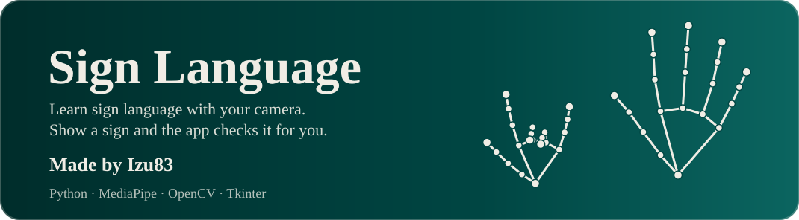
</p>

<p align="center">
  
  
  
  
</p>

<p align="center">
  Learn sign language with your webcam. One big sign on screen, you make it in front of the camera,
  and the app checks it and moves on to the next.
</p>

<h2></h2>

- **Tracks your hand** with your webcam and recognises 22 signs: letters, numbers and everyday words.
- **One sign at a time.** A big picture, the meaning and a one-line description of how to make it sit next to the camera.
- **Two ways to practise.** *Sign + meaning* shows the picture and the word. *Meaning only* shows just the word, so you have to remember the sign, with a hint button if you get stuck.
- **Checks you automatically.** Hold the sign for about half a second and it is ticked off and the next one appears. Skip any sign you want to leave for later.
- **Hand outline on or off.** Show the tracked hand skeleton on the camera, or hide it. Press `H` to switch.
- **Saves your progress** between sessions, with a reset whenever you want a fresh start.
- **Runs offline.** Hand tracking happens on your PC. Nothing from your camera is uploaded.
- **Bring your own pictures.** Every sign picture is a PNG in `images/`; drop in a file with the same name to replace it.

<h2></h2>

<table>
  <tr>
    <td align="center" width="25%">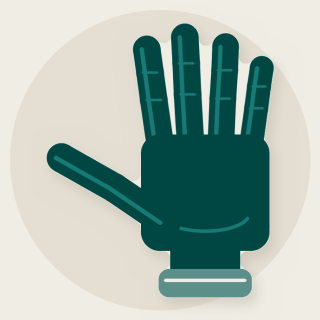<br><b>Hello</b></td>
    <td align="center" width="25%">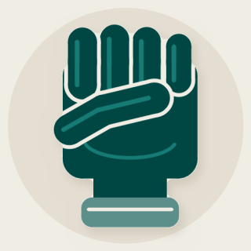<br><b>Yes</b></td>
    <td align="center" width="25%">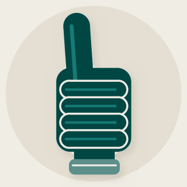<br><b>Good</b></td>
    <td align="center" width="25%">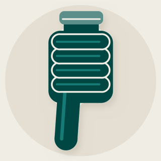<br><b>Bad</b></td>
  </tr>
  <tr>
    <td align="center" width="25%">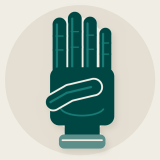<br><b>Four</b></td>
    <td align="center" width="25%">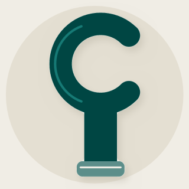<br><b>Letter C</b></td>
    <td align="center" width="25%">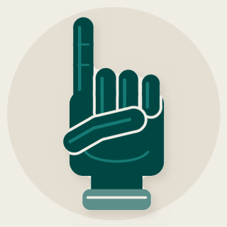<br><b>Letter D</b></td>
    <td align="center" width="25%">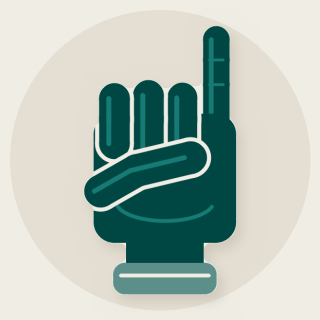<br><b>Letter I</b></td>
  </tr>
  <tr>
    <td align="center" width="25%">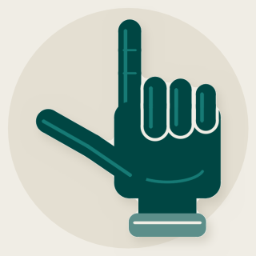<br><b>Letter L</b></td>
    <td align="center" width="25%">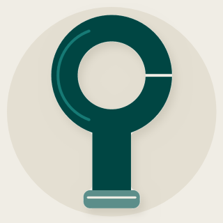<br><b>Letter O</b></td>
    <td align="center" width="25%">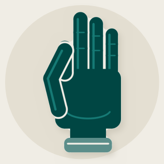<br><b>OK</b></td>
    <td align="center" width="25%">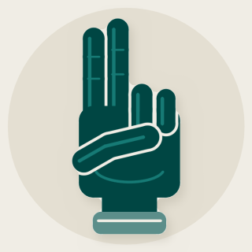<br><b>Letter U</b></td>
  </tr>
  <tr>
    <td align="center" width="25%">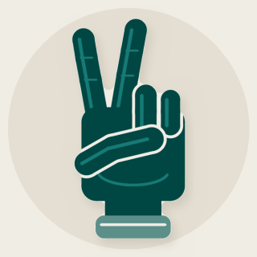<br><b>Letter V</b></td>
    <td align="center" width="25%">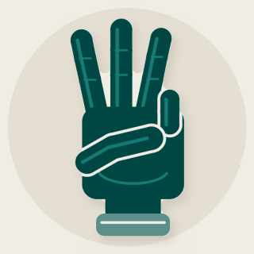<br><b>Letter W</b></td>
    <td align="center" width="25%">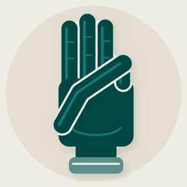<br><b>Six</b></td>
    <td align="center" width="25%">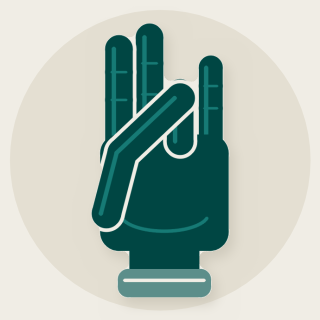<br><b>Seven</b></td>
  </tr>
  <tr>
    <td align="center" width="25%">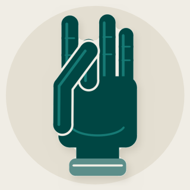<br><b>Eight</b></td>
    <td align="center" width="25%">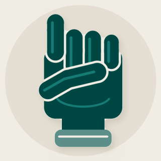<br><b>Letter X</b></td>
    <td align="center" width="25%">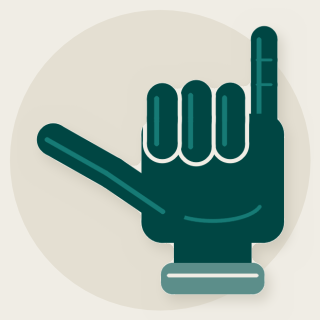<br><b>Letter Y</b></td>
    <td align="center" width="25%">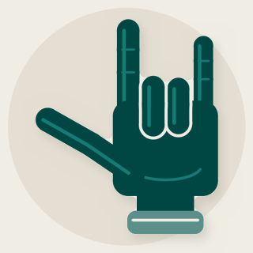<br><b>I love you</b></td>
  </tr>
  <tr>
    <td align="center" width="25%">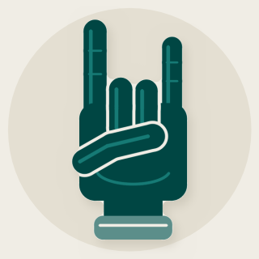<br><b>Rock on</b></td>
    <td align="center" width="25%">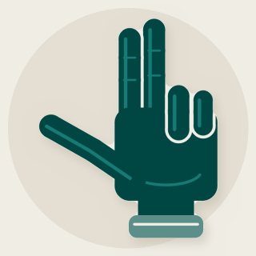<br><b>Three</b></td>
    <td></td>
    <td></td>
  </tr>
</table>

Recognition looks at the shape of the hand, not its movement, so signs that need motion (like J or Z) are not included.

<h2></h2>

You need Python 3.10 or newer and a webcam.

```bash
git clone https://github.com/Izu83/Sign-Language.git
cd Sign-Language
pip install -r requirements.txt
python src/main.py
```

The first launch downloads Google's hand-tracking model (about 8 MB) into `models/`, so it needs an internet connection once.

<h2></h2>

1. Pick a mode at the top of the right-hand panel.
2. Look at the sign shown, then make it with one hand in front of the camera.
3. Hold it steady until the banner appears. The app moves on by itself.
4. Not feeling one? Press **Skip**. Want to start over? Press **Reset progress**.

| Key or button | What it does |
| --- | --- |
| `Sign + meaning` / `Meaning only` | Switch between learning and guessing |
| `Show me the sign` | Reveal the picture in guessing mode |
| `Skip →` | Move to the next sign without ticking this one off |
| `H` or `Hand outline` | Show or hide the hand skeleton on the camera |
| `Reset progress` | Clear everything you have learned |

<h2></h2>

Each sign is described once in `src/signs.py`: how curled each finger is, and what the thumb is doing. That single description is used twice.

- **Recognition.** MediaPipe finds 21 landmarks on your hand. The app measures how curled each finger is and where the thumb is, then picks the closest matching sign. The sign has to be held for a few frames so a passing hand shape does not count.
- **Pictures.** `src/art.py` draws the illustration for each sign from the same description, so the picture you see is the shape the camera looks for.

<h2></h2>

| Path | What it is |
| --- | --- |
| `src/main.py` | The window, camera loop and progress |
| `src/signs.py` | The signs and the code that recognises them |
| `src/art.py` | Draws the pictures (`python src/art.py` redraws all of them) |
| `images/` | One PNG per sign |
| `assets/` | The banner and section headers used in this README |
| `models/` | The downloaded hand model (not committed) |
| `data/` | Your saved progress and settings (not committed) |

<h2></h2>

- **Font.** Change `FONT_NAME` at the top of `src/main.py`. It falls back to Georgia if the font is not installed.
- **Colours.** Cyprus `#004643` and Sand `#F0EDE5`, defined at the top of `src/main.py` and `src/art.py`.
- **How long to hold a sign.** `HOLD_FRAMES` in `src/main.py`.
- **How strict matching is.** The thresholds in `src/signs.py` (`detect` and `_curl`).
- **Add a sign.** Add an entry to `SIGNS` in `src/signs.py` with its finger curls and thumb, then run `python src/art.py` to draw its picture.

<h2></h2>

- **"Camera not found".** Close other apps that use the webcam, and check your camera permissions in Windows settings.
- **The model will not download.** Download `hand_landmarker.task` from Google's MediaPipe models page and put it in `models/`.
- **A sign will not register.** Keep your whole hand in view, well lit, with the palm facing the camera, and hold it still for a moment. Similar shapes such as D and L, or O and OK, need the thumb clearly placed.
- **Wrong font.** The app uses Georgia unless the font in `FONT_NAME` is installed.

<p align="center">
  <br>
  Made by <b>Izu83</b>
</p>
